# Memory Training App

A responsive web application designed as part of my master's thesis. It focuses on improving users' working memory through psychology-based cognitive exercises.

## ✨ Features

- 🧠 **Cognitive Training** – three exercises (Number Span, Verbal Memory, Corsi Block).
- 📈 **Performance Tracking** – results visualized with Plotly.js.
- 🔐 **Firebase Authentication** – secure login & registration.
- 🗃️ **Firestore Database** – stores results and user statistics.
- 🎨 **Custom UI** – designed in Figma, implemented with Material UI.
- 📱 **Fully Responsive** – optimized for desktop and mobile.

---

## 📱 Mobile Preview

  
   
  Quick look at the mobile flow.

---

## 🖼️ Screens & Flows

### Home

<table>
  <tr>
    <td>
      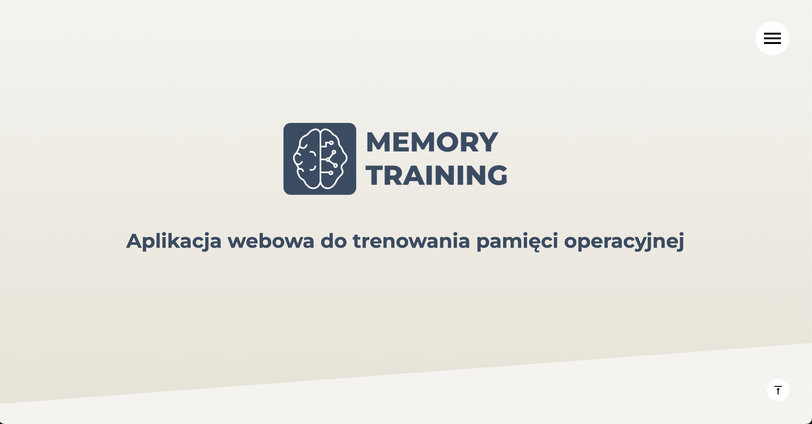
       Hero section.
    </td>
    <td>
      
       Header.
    </td>
  </tr>
  <tr>
    <td>
      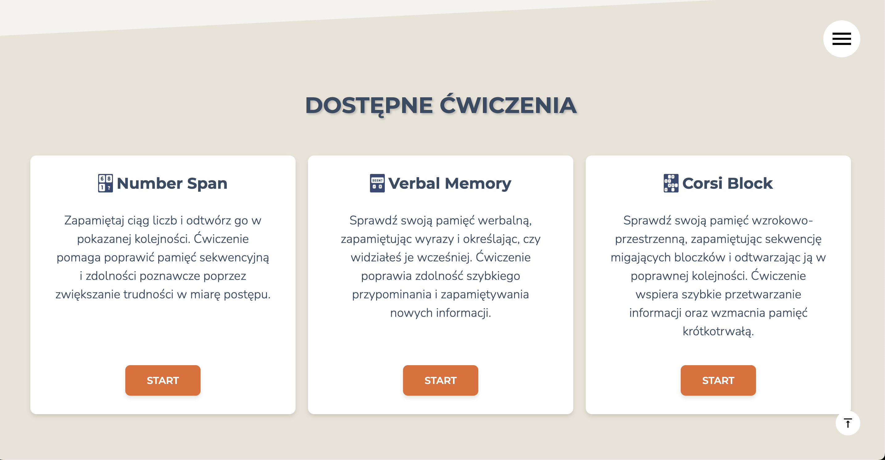
       Exercises overview.
    </td>
    <td>
      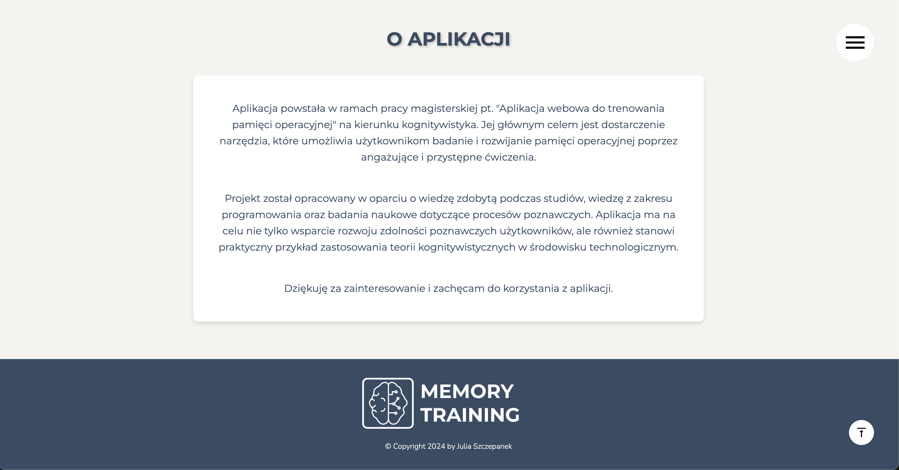
       About application.
    </td>
  </tr>
</table>

### Navigation

<table>
  <tr>
    <td>
      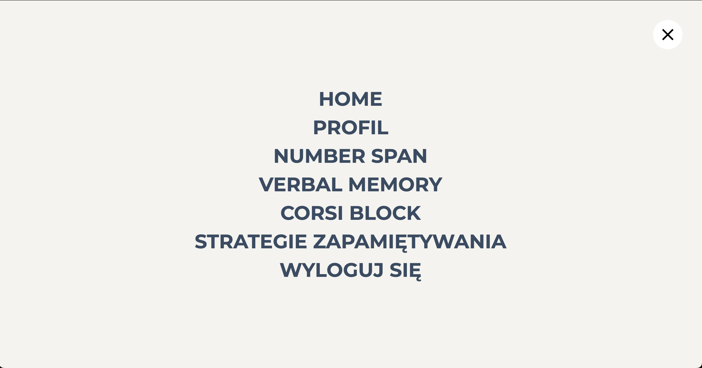
       Navigation on desktop.
    </td>
    <td width="380">
      
       Mobile navigation.
    </td>
  </tr>
</table>

### Corsi Block

<table>
  <tr>
    <td>
      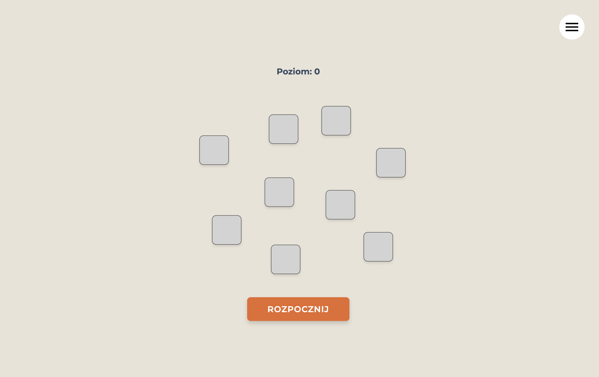
       Corsi Block test (desktop).
    </td>
    <td width="380">
      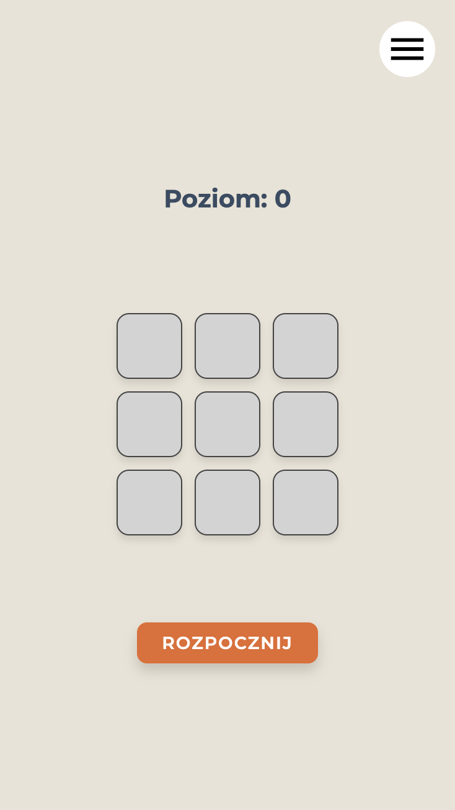
       Same task on mobile.
    </td>
  </tr>
</table>

### Number Span

<table>
  <tr>
    <td>
      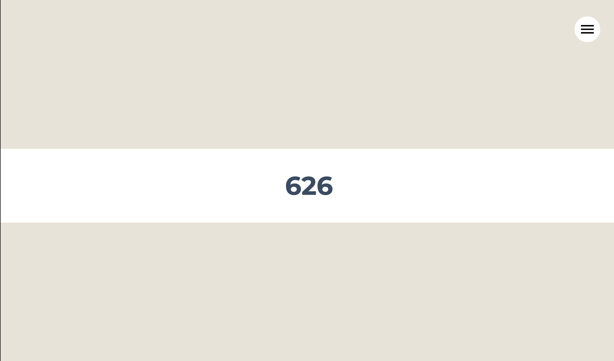
       Number Span challenge.
    </td>
    <td>
      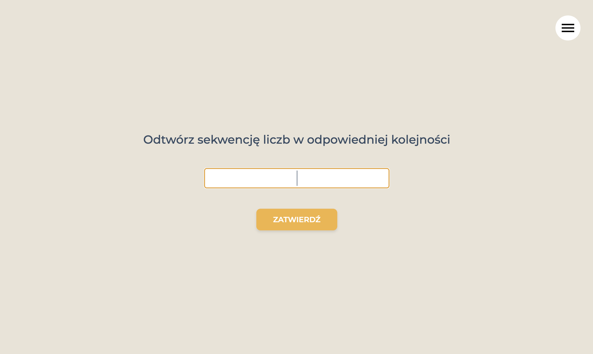
       Input for Number Span.
    </td>
  </tr>
</table>

### Verbal Memory

  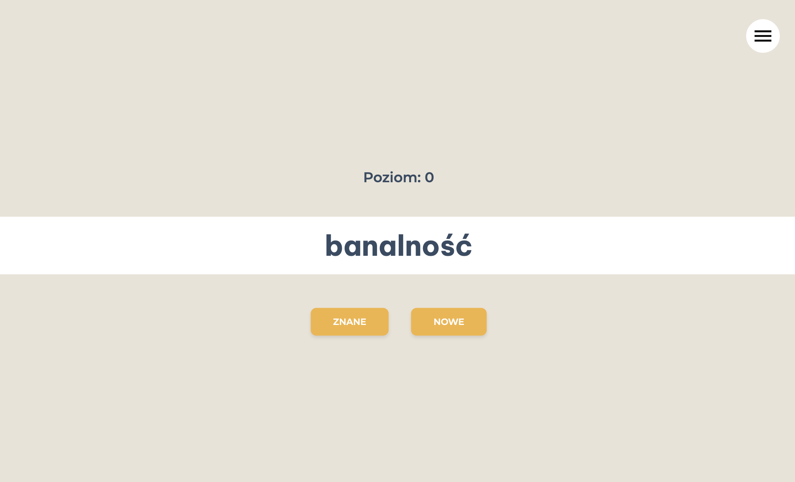
   Verbal memory flow.

### Auth

<table>
  <tr>
    <td>
      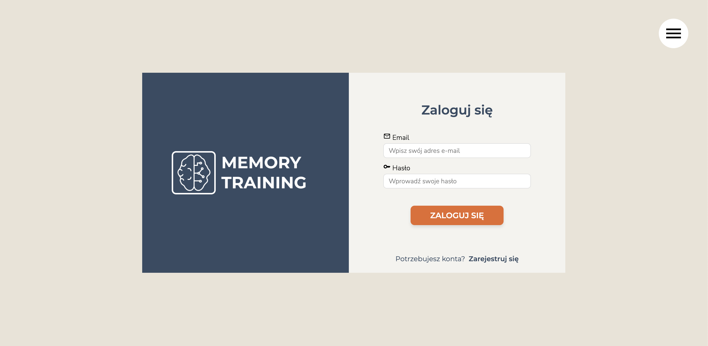
       Secure login with Firebase Auth.
    </td>
    <td>
      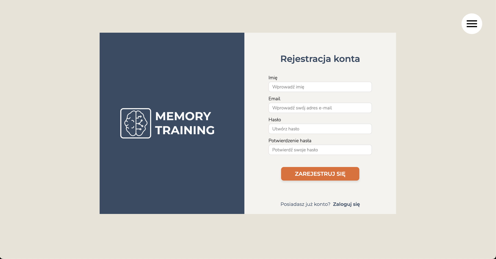
       Simple account creation.
    </td>
  </tr>
</table>

### Profile

  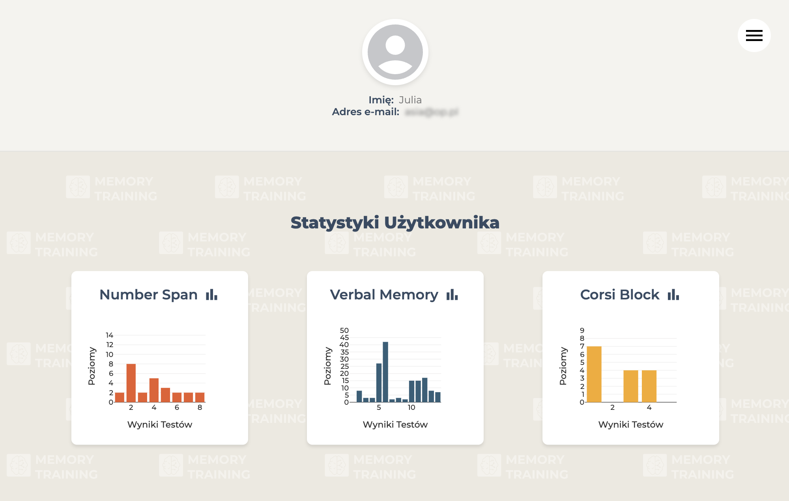
   Personal stats & Profile.

---

<a href="https://memory-training-mta.netlify.app/">Live Preview</a>

---

## 🚀 Tech Stack

- React.js
- JavaScript
- Firebase (Auth) & Firestore
- React Router
- Material UI
- Plotly.js
- CSS (Sass)
- Vite
- React Bootstrap
